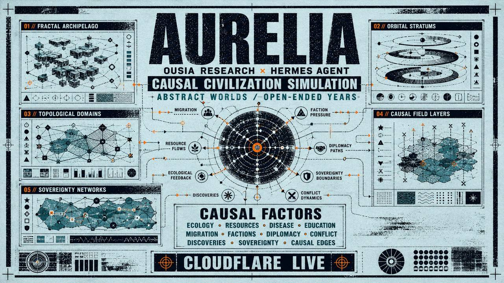

# Aurelia



> **A causal civilization simulation built by Ousia Research, operated by Hermes Agent.**
>
> Aurelia is not a map. It is a living causal engine: a graph where every event — every drought, faction split, treaty, migration, discovery, disease, education surge, sovereignty shift — feeds the next tick.

Five abstract worlds, runnable for any number of years, persisted live to Cloudflare, and replayable as a queryable causal history.

---

## Two ways to start

Aurelia serves two audiences from the same repository:

- **Researchers** who want the data: [`docs/AURELIA_RESEARCH_START_HERE.md`](docs/AURELIA_RESEARCH_START_HERE.md) — load the four HuggingFace datasets, reproduce the density-diversification result, trace a causal chain.
- **Lore readers** who want the world: [`docs/AURELIA_LORE_READERS_START_HERE.md`](docs/AURELIA_LORE_READERS_START_HERE.md) — the five countries, the four sentient types, the question Aurelia keeps asking.

Both lead back to the canon bridge at [`docs/AURELIA_CANON_AND_DATA_GUIDE.md`](docs/AURELIA_CANON_AND_DATA_GUIDE.md), which maps every major concept across wiki, code, table, dataset, and proof artifact.

---

## Table of contents

- [What is Aurelia?](#what-is-aurelia)
- [Why it exists](#why-it-exists)
- [Core ideas](#core-ideas)
- [Causal model](#causal-model)
- [Architecture](#architecture)
- [Repository layout](#repository-layout)
- [Quickstart](#quickstart)
- [Running a simulation](#running-a-simulation)
- [Five abstract worlds](#five-abstract-worlds)
- [Yearly reports](#yearly-reports)
- [Federation and cross-world dynamics](#federation-and-cross-world-dynamics)
- [Causal edges, not comments](#causal-edges-not-comments)
- [Cloudflare persistence](#cloudflare-persistence)
- [HuggingFace datasets](#huggingface-datasets)
- [Tests](#tests)
- [Documentation map](#documentation-map)
- [Roadmap](#roadmap)
- [Citation](#citation)
- [License](#license)
- [Credits](#credits)

---

## What is Aurelia?

Aurelia is a self-running, multi-world civilization simulation. It is designed to answer a single question with empirical rigor:

> **What actually happens to civilizations when you let ecology, resources, disease, education, migration, factions, diplomacy, conflict, discoveries, and sovereignty evolve together over time?**

It is built as a real causal engine — not a script, not a visual novel, not a turn-based game. Worlds tick forward. Causal events are recorded as first-class rows. Per-year reports capture births, deaths, species, factions, discoveries, migrations, treaties, and failures. Causal edges are replayable, queryable, and ready for counterfactual branching.

Aurelia is created by **Ousia Research** and operated by **Hermes Agent**, the agent runtime that runs the simulation, manages the worlds, records the chronicles, and persists historical state to **Cloudflare**.

## Why it exists

Most "civilization simulators" are world maps with a static story. Aurelia is a *causal* system. Every outcome in the world has a recorded cause. If the graph is wrong, the world is wrong.

Aurelia exists to:

1. Make civilization dynamics a **causal graph**, not a narrative.
2. Make every micro NPC event **traceable upward** to macro geopolitics and economics.
3. Make macro dynamics **emit downward** to the populations, factions, and events that caused them.
4. Make **cross-world effects** real (migrations, cultural diffusion, diplomacy, conflict).
5. Make **counterfactual branching** cheap and queryable.
6. Make the whole thing **operable** by an AI agent, end to end, with no human in the loop.

## Core ideas

- **Abstract worlds, not fictional Earths.** No real-world maps, no real countries, no real coastlines. Aurelia uses impossible archipelagos, symbolic terrain grids, orbital slices, abstract topologies, and fictional causal-map glyphs. The point is to let civilizations emerge from constraint, not to render fantasy.
- **Open-ended years.** The simulation can run for as many years as you want. There is no fixed 50-year or 200-year cap. No scripted ending. History keeps going until you stop it.
- **Causal edges are first-class artifacts.** They are rows in a `causal_events` table, imported into the graph, replayable, queryable, and ready for counterfactual branching. They are not comments, not labels, not post-hoc annotations.
- **Hermes Agent is the operator.** It runs the simulation, manages the worlds, records the chronicles, and pushes snapshots and historical state to Cloudflare.
- **Cloudflare is the memory layer.** Per-year snapshots, chronicle entries, world state, and causal summaries are pushed live, so Aurelia is a real system, not a notebook.

## Causal model

Every event in Aurelia is a `causal_event` row with:

- `event_id` (UUID)
- `tick_number`
- `world_id`
- `layer` ∈ `micro` | `meso` | `macro` | `federation`
- `event_type`
- `actor_ids` (which NPCs/factions/regions caused it)
- `target_ids` (which NPCs/factions/regions were affected)
- `scope` (local, regional, world, federation)
- `magnitude`, `valence`, `confidence`
- `payload` (JSON)
- `created_at`

Higher-level systems (micro interactions, meso aggregators, macro dynamics, federation resolver) all write into the same ledger via `src_template/causal_ledger.py`. This is the substrate of the simulation. If a subsystem needs to record what happened, what it caused, and what should be applied later, it goes here.

## Architecture

Aurelia is a Python codebase with a SQLite-per-world database layout and a federation coordinator that runs across worlds.

```
aurelia/
├── aurelia_factory.py            # Build & seed new worlds
├── aurelia_coordinator.py        # Federation coordinator across N worlds
├── aurelia_diplomacy.py          # Federation diplomacy subsystem
├── aurelia_cf_pusher.py          # Cloudflare push of snapshots, chronicles, state
├── causal_run.py                 # Convenience CLI: tick N years, push to Cloudflare
├── deep_seed.py                  # Deep-world seeder (lore, NPCs, factions, ecology)
├── populate_npcs.py              # Procedural NPC generation
├── migrate_schema.py             # SQLite schema migrations
├── world_daemon_template.py      # Single-world daemon template
├── src_template/                 # Engine source (~75 modules)
│   ├── world_state.py            # Schema + state management
│   ├── simulation.py             # Full world tick
│   ├── causal_ledger.py          # Causal event graph
│   ├── phase10_dynamics.py       # Phase 10: causal gap closure runtime
│   ├── capital_economy.py        # Productive value creation
│   ├── macro_dynamics.py         # Macro aggregation
│   ├── federation_orchestrator.py# Federation tick driver
│   ├── federation_diplomacy.py   # Cross-world relations
│   ├── federation_effects.py     # Cross-world event application
│   ├── cultural_diffusion.py     # Cross-world culture propagation
│   ├── ecology.py                # Plants, animals, decay, growth
│   ├── demography.py             # Births, deaths, age cohorts
│   ├── discovery.py              # Discoveries, great persons
│   ├── institutions.py           # State capacity, property rights
│   ├── reconciliation.py         # Post-conflict peace processes
│   ├── rituals.py                # Seasonal events
│   ├── great_persons.py          # Great persons emergence
│   ├── escalation_ladder.py      # Conflict type transitions
│   ├── yearly_report.py          # Per-year chronicle writer
│   └── ... (~60 more)
├── scripts/                      # Phase 11 proof tools: graph export, explanations, reports, quality scoring
├── tests/                        # Pytest suite (70+ tests)
├── docs/                         # Phase design notes, deep dives, plans
├── configs/                      # Per-world YAML profiles
└── colab/                        # Google Colab speed-run notebook
```

## Repository layout

| Path                          | Purpose                                                                |
|------------------------------|------------------------------------------------------------------------|
| `aurelia_factory.py`         | Builds and seeds new worlds from a config                             |
| `aurelia_coordinator.py`     | Federation coordinator across N worlds                                |
| `aurelia_diplomacy.py`       | Diplomacy subsystem (relations, treaties, trust)                      |
| `aurelia_cf_pusher.py`       | Pushes snapshots, chronicles, state to Cloudflare                     |
| `causal_run.py`              | Convenience runner: tick N years, push to Cloudflare                  |
| `src_template/`              | The engine itself (~75 modules, ~25k lines)                           |
| `src_template/phase10_dynamics.py` | Phase 10 causal-gap closure runtime                              |
| `src_template/capital_economy.py` | Phase 9 productive value creation                                |
| `src_template/causal_ledger.py`   | The causal event graph (first-class rows)                       |
| `scripts/`                  | Phase 11 proof tools: causal graph export, event explanation, reports, quality scoring |
| `tests/`                     | Pytest test suite                                                     |
| `docs/`                      | Phase design notes, deep dives, plans, analysis                       |
| `configs/`                   | Per-world YAML profiles (Solara, Arkos, Mirithane, Valdris, Verge)    |
| `colab/`                     | Google Colab speed-run notebook and driver                            |
| `docs/assets/cover.jpg`      | Cover art for this repository                                         |

## Quickstart

```bash
# Clone
git clone https://github.com/ousiaresearch/aurelia.git
cd aurelia

# Use a virtualenv (Python 3.11+)
python3 -m venv .venv
source .venv/bin/activate
pip install -U pip pytest

# Run the test suite
PYTHONPATH=. pytest tests/ -q
# 171 passed
```

## Running a simulation

The fastest path is the convenience runner:

```bash
# Run 50 years of an existing federation setup, push to Cloudflare
PYTHONPATH=. python causal_run.py
```

To run a federation from a clean slate:

```bash
# 1. Build five worlds from configs/
PYTHONPATH=. python aurelia_factory.py --config configs/solara.yaml
PYTHONPATH=. python aurelia_factory.py --config configs/arkos.yaml
PYTHONPATH=. python aurelia_factory.py --config configs/mirithane.yaml
PYTHONPATH=. python aurelia_factory.py --config configs/valdris.yaml
PYTHONPATH=. python aurelia_factory.py --config configs/verge.yaml

# 2. Run the federation coordinator
PYTHONPATH=. python aurelia_coordinator.py --ticks 200
```

To run a single world daemon:

```bash
# Use the world daemon template, parameterized by world id
PYTHONPATH=. python world_daemon_template.py --world solara
```

## Phase 11 proof tools

Aurelia ships local inspection tools that turn completed run directories into audit artifacts:

```bash
# Export a causal graph slice for one world
PYTHONPATH=.:scripts python scripts/export_causal_graph.py \
  --run-dir /tmp/aurelia-bolster-scan \
  --world solara \
  --run-id phase11-bolster-scan-y5-seed4242 \
  --start-tick 1 \
  --end-tick 3 \
  --output docs/examples/phase11-solara-graph.json

# Explain one event by walking upstream causal edges
PYTHONPATH=.:scripts python scripts/explain_event.py \
  --db /tmp/aurelia-bolster-scan/solara.db \
  --event-id <event_id> \
  --depth 3

# Render a human-readable run report
PYTHONPATH=.:scripts python scripts/render_run_report.py \
  --run-dir /tmp/aurelia-bolster-scan \
  --output docs/reports/phase11-bolster-scan-report.md

# Score run quality before committing to longer production runs
PYTHONPATH=.:scripts python scripts/evaluate_run_quality.py \
  --run-dir /tmp/aurelia-bolster-scan \
  --output docs/reports/phase11-bolster-scan-quality.json
```

Sample outputs are committed under `docs/examples/` and `docs/reports/`.

## Five abstract worlds

Each world is an invented topology, not a fictional Earth.

- **Solara** — bright arcology cluster, dense micro NPC depth
- **Arkos** — fragmented archipelago, high-friction ecology
- **Mirithane** — orbital-style lattice worlds, extreme resource volatility
- **Valdris** — mountain range, sustained cold-water scarcity
- **Verge** — coastal grid, the most diverse faction pressure

Each world is configured in `configs/<name>.yaml` and is launched by `aurelia_factory.py`.

## Yearly reports

Aurelia writes a per-year chronicle for every world via `src_template/yearly_report.py`. Each year captures:

- births and deaths
- species and demographics
- factions and faction lifecycle
- discoveries and great persons
- migrations
- treaties and sovereignty shifts
- causal event counts by layer

Reports are the first thing the operator (Hermes Agent) reads. They are also pushed to Cloudflare so that history is durable.

## Federation and cross-world dynamics

Federation is the subsystem that connects the five worlds.

- `federation_orchestrator.py` drives the federation tick.
- `federation_diplomacy.py` maintains relations, treaties, trust.
- `federation_effects.py` applies cross-world effects to world state.
- `cultural_diffusion.py` propagates culture across worlds via contact and migration.
- `phase10_dynamics.py` adds cross-world NPC movement, foreign strategy intervention under environmental and public-health crises, and diplomatic trust accumulation.

Causality flows both directions:

```
micro → meso → macro → federation
federation → macro → meso → micro
```

## Causal edges, not comments

Causality is recorded explicitly. Every effect that has a cause gets a `causal_events` row. Every row has:

- source world, source layer, source event
- target world, target layer, target event
- magnitude, valence, confidence
- payload

This is what makes Aurelia *causal* rather than narrative. You can ask:

- What caused the famine in Mirithane year 47?
- Which diplomacy events are downstream of Arkos year 22's resource collapse?
- What would have happened in Valdris year 80 if Verge had not migrated south?

…and the answer is a query against the causal graph.

## Cloudflare persistence

Aurelia bulk-pushes completed run artifacts to Cloudflare via `aurelia_cf_pusher.py`.
The current production ingestion path persists:

- world registration and population/faction summaries
- per-year demographic snapshots
- discoveries
- great persons
- chronicle text and metadata

The Cloudflare layer is the durable memory. It is what makes Aurelia a real system, not a notebook. Phase 11 extends this public data plane with raw causal events, causal edges, cross-world movements, diffusion events, run manifests, and graph-query endpoints.

**Important:** the Worker uses the D1 Free plan, which has a 500MB storage cap. For long runs (Phase 11 `phase11-200y` and beyond), the cap has caused **partial movement/diffusion ingestion** — some cross-world movements and diffusion events are not present in the public Cloudflare dashboard. Cloudflare is therefore the **public observability plane**, not the complete archive for long runs. The local Parquet export at `/tmp/hf-export/` and the four HuggingFace datasets are the **complete research archive** for Phase 11. The reconciliation report at `docs/reports/public-surface-reconciliation.md` is regenerated by `scripts/reconcile_public_surfaces.py` and lists exactly which surfaces are complete, partial, or missing for the most recent runs.

Public surfaces:

- Observatory: `https://hermes-state-worker.plntrprotocol.workers.dev/public/aurelia/observatory`
- Dashboard JSON: `https://hermes-state-worker.plntrprotocol.workers.dev/public/aurelia/dashboard`
- Latest runs JSON: `https://hermes-state-worker.plntrprotocol.workers.dev/public/aurelia/runs`

Operator endpoints:

- Worker: `https://hermes-state-worker.plntrprotocol.workers.dev`
- Authenticated dashboard: `https://hermes-state-worker.plntrprotocol.workers.dev/aurelia/dashboard`
- Project: `~/.hermes/profiles/palantir/cf-worker/` (D1 + R2, R2 for chronicle artifacts, D1 for indexed queries)

## Start with the research examples

If you want to inspect Aurelia rather than read about it:

```bash
PYTHONPATH=. python3 examples/01_load_aurelia_hf_datasets.py
PYTHONPATH=. python3 examples/02_reproduce_density_diversification.py
PYTHONPATH=. python3 examples/03_trace_causal_chain.py
PYTHONPATH=src_template python3 examples/04_run_counterfactual_branch.py
```

All four work offline. The second reproduces the headline **99.1% cross-world population-CV reduction** when the density-diversification knob is on. The third walks a causal chain three hops upstream from a federation event. The fourth runs a paired-simulation counterfactual (same seed, density_diversification 0.0 vs 1.0) and prints a divergence report; see [`docs/AURELIA_COUNTERFACTUALS.md`](docs/AURELIA_COUNTERFACTUALS.md) for the full pattern. See [`docs/AURELIA_RESEARCH_START_HERE.md`](docs/AURELIA_RESEARCH_START_HERE.md) for the full path.

## HuggingFace datasets

The same run artifacts that flow into Cloudflare are also exported as four
HuggingFace-ready Parquet datasets, published under the
[`ousiaresearch`](https://huggingface.co/ousiaresearch) namespace:

| repo | content | rows | size |
|---|---|---|---|
| [`ousiaresearch/aurelia-causal-events`](https://huggingface.co/datasets/ousiaresearch/aurelia-causal-events) | per-world causal event stream | 560,428 | 27 MB |
| [`ousiaresearch/aurelia-civilization-metrics`](https://huggingface.co/datasets/ousiaresearch/aurelia-civilization-metrics) | yearly world state trajectories | 12,600 | 1.1 MB |
| [`ousiaresearch/aurelia-federation-causal`](https://huggingface.co/datasets/ousiaresearch/aurelia-federation-causal) | federation events + causal edges | 114,133 | 4.7 MB |
| [`ousiaresearch/aurelia-npc-population`](https://huggingface.co/datasets/ousiaresearch/aurelia-npc-population) | NPC snapshots at end of run | 25,799 | 1.9 MB |

All four are released under **CC-BY-4.0** (synthetic data, no privacy concerns).
The on-disk layout is `data/<run_id>/train.parquet` with one directory per
simulation run, so you can grab a specific run with `data_files`:

```python
from datasets import load_dataset
ds = load_dataset(
    "parquet",
    data_files="ousiaresearch/aurelia-civilization-metrics/data/phase11-200y/train.parquet",
)["train"]
```

The five runs currently included are described in the
[Phase 11 runs comparison report](docs/reports/phase11-runs-comparison.md):

| run_id | config | years |
|---|---|---|
| `phase11-bolster-scan-y5` | baseline 5-year | 5 |
| `phase11-100y` | baseline 100-year | 100 |
| `phase11-200y` | baseline 200-year | 200 |
| `phase11-density-100y` | density-diversification knob (0.7) | 100 |
| `phase11-cf-solara-aid` | counterfactual: solara federation aid early | 5 |

To reproduce the exports from local runs:

```bash
export HF_OUT=/tmp/hf-export
mkdir -p $HF_OUT
for pair in "causal_events:causal-events" \
            "civilization_metrics:civilization-metrics" \
            "federation_causal:federation-causal" \
            "npc_population:npc-population"; do
  ds_key=${pair%%:*}; slug=${pair##*:}
  PYTHONPATH=. python3 scripts/export_hf_dataset.py \
    --dataset "$ds_key" --auto \
    --out "$HF_OUT/aurelia-$slug" \
    --format parquet --manifest
  PYTHONPATH=. python3 scripts/render_hf_readme.py \
    --dataset "$ds_key" --export-root "$HF_OUT"
done
```

Uploading requires a write token; the full procedure is in
[`docs/HUGGINGFACE_PUBLISH.md`](docs/HUGGINGFACE_PUBLISH.md).

## Tests

```bash
PYTHONPATH=. pytest tests/ -q
# 171 passed
```

Coverage focuses on:

- causal mechanics (`test_causal_mechanics.py`, `test_causal_ledger.py`)
- Phase 8 resilience, divergence, migration, factions, profiles, reporting (`test_phase8_*.py`)
- Phase 9 culture, diplomacy, economy, institutions, regime (`test_phase9_*.py`)
- Phase 10 causal-gap closure (`test_phase10_causal_gaps.py`)
- federation event bus and orchestrator (`test_federation_*.py`)
- NPC AI (`test_npc_ai_aurelia.py`)

## Documentation map

`docs/` holds the design record:

- `docs/ARCHITECTURE.md` — runtime/data-plane architecture
- `docs/DEMO.md` — reproducible quick demo and inspection flow
- `docs/ROADMAP.md` — Phase 10–13 roadmap
- [`docs/PHASE13_VERIFIED_CHRONICLES.md`](docs/PHASE13_VERIFIED_CHRONICLES.md) — Phase 13 contract for provenance-preserving narrative artifacts
- `docs/SOCIAL_PROOF.md` — public positioning and proof kit
- `docs/world-sociology.md` — sociological scaffolding behind the world types
- `docs/diplomatic-matrix.md` — the diplomacy type matrix
- `docs/type-politics.md` — political-type scaffolding
- `docs/phase-1-meaningful-npc-tick.md` — Phase 1 design (meaningful NPC ticks)
- `docs/phase-2-federation-event-bus.md` — Phase 2 design (federation event bus)
- `docs/phase-3-diplomacy-trigger-engine.md` — Phase 3 design (diplomacy triggers)
- `docs/analysis/2026-06-08-aurelia-causal-gaps-deep-dive.md` — the deep dive that produced Phase 10
- `docs/plans/2026-06-04-phase*.md` and `phase*.5*.md` — phase plan notes
- `docs/plans/2026-06-06-cloudflare-persistent-simulation-stream.md` — Cloudflare persistence plan
- `docs/plans/2026-06-08-causal-federated-simulation-rearchitecture.md` — causal rearchitecture plan
- `docs/plans/2026-06-08-phase8-resilience-divergence-migration-faction-consequences.md` — Phase 8 plan
- `docs/plans/2026-06-08-phase9-positive-sum-dynamics.md` — Phase 9 plan

## Roadmap

The roadmap is the causal gap closure process. Each phase closes a specific class of missing cause.

- **Phase 1–3**: meaningful NPC ticks, federation event bus, diplomacy trigger engine
- **Phase 4–6**: decision-driven growth, 60k scaling, emergent geopolitics
- **Phase 7**: causal ledger as durable first-class graph
- **Phase 8**: resilience, divergence, migration, faction consequences
- **Phase 9**: positive-sum dynamics (capital economy, culture, regime, institutions)
- **Phase 10**: causal-gap closure — ecology, resources, inequality, infrastructure, demographics, education, urbanization, disease, state capacity, property rights, conflict type, path dependence, innovation, great persons, rituals, reconciliation, goals, peace treaties, sovereignty, cross-world NPC movement, cultural diffusion, foreign strategy, and causal graph edges
- **Phase 11**: observatory and counterfactual proof layer — canonical release, Cloudflare causal ingestion, graph export, run reports, public dashboard, quality metrics, and paired counterfactual branches
- **Phase 12**: calibrated production histories — engine stability, refreshed proof reports, counterfactual UX, and seed-sweep evidence
- **Phase 13**: verified chronicle layer — provenance-preserving narrative artifacts from real run histories

## Citation

If you use Aurelia in research or a publication, please cite:

```bibtex
@software{aurelia2026,
  title  = {Aurelia: A Causal Civilization Simulation},
  author = {Ousia Research},
  year   = {2026},
  url    = {https://github.com/ousiaresearch/aurelia}
}
```

## License

MIT. See `LICENSE`.

## Credits

- **Ousia Research** — design, architecture, simulation engine
- **Hermes Agent** — operator, runner, Cloudflare persistence
- Cover art: Ousia Research / Hermes Agent
